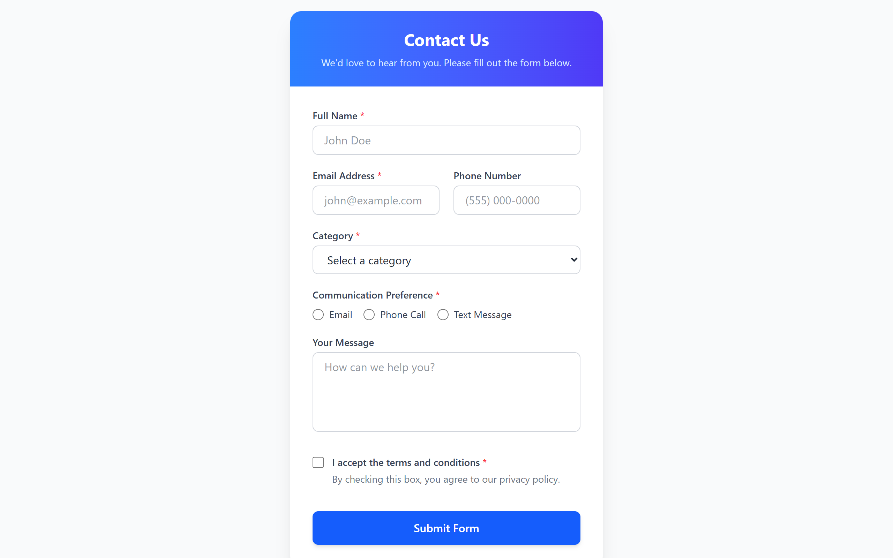

# React Contact Form

This project is a modern, responsive "Contact Us" form built with React and Tailwind CSS. It is designed to capture user inquiries and feedback in a structured and user-friendly manner.

## Purpose

The primary use of this form is to provide a clean and intuitive interface for users to get in touch with support, sales, or provide general feedback. It handles user input dynamically, manages form state using React Hooks, and includes basic validation to ensure necessary information is provided before submission.

## Form Fields

The form collects the following information from the user:

*   **Full Name**: A standard text input for the user's name (Required).
*   **Email Address**: An email input field to capture contact information (Required).
*   **Phone Number**: A telephone input for optional voice contact.
*   **Category**: A dropdown menu allowing the user to select the nature of their inquiry (e.g., Technical Support, Sales Inquiry, General Feedback, or Other) (Required).
*   **Communication Preference**: Radio buttons allowing the user to select their preferred method of contact (Email, Phone Call, or Text Message) (Required).
*   **Your Message**: A multi-line text area for the user to elaborate on their request or provide additional details.
*   **Terms and Conditions**: A mandatory checkbox ensuring the user agrees to the privacy policy before submitting the form (Required).

## Features

*   **Responsive Design**: The form looks great on both desktop and mobile devices.
*   **Real-time State Management**: Uses React's `useState` hook to manage input fields efficiently.
*   **Validation & Error Handling**: Ensures that mandatory fields (like the terms and conditions and communication preference) are completed before allowing form submission, displaying error or success messages accordingly.
*   **Tailwind CSS Styling**: Utilizes modern utility classes for a clean, cohesive, and accessible user interface.

## How to Run Locally

To get this project running on your local machine:

1.  Clone the repository to your local machine.
2.  Open your terminal and navigate to the project directory.
3.  Run `npm install` to install all necessary dependencies.
4.  Run `npm run dev` to start the development server.
5.  Open your browser and navigate to the local URL provided in the terminal (usually `http://localhost:5173`).
